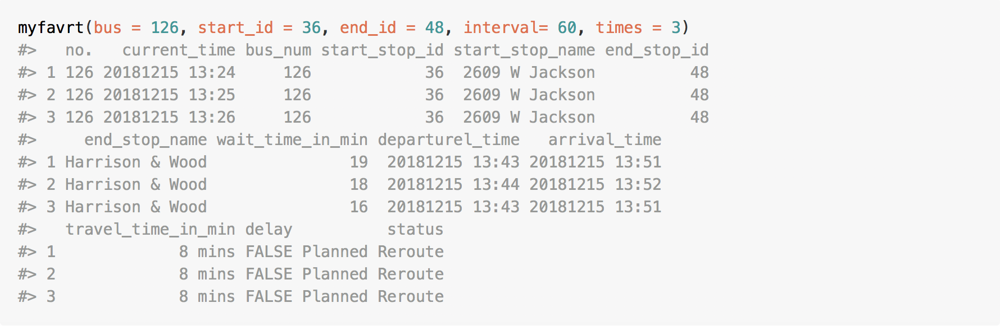

<!-- README.md is generated from README.Rmd. Please edit that file -->
rCTA
====

`rCTA` is an R interfact to access the APIs of Chicago Transit Authority(CTA) in order to get real-time information of buses and help users make empowered decisions about their trip.The APIs include **Bus Tracker API** and **Customer Alerts API**. Check out the documentations here:

[Bus Tracker API Documentation](https://www.transitchicago.com/assets/1/6/cta_Bus_Tracker_API_Developer_Guide_and_Documentation_20160929.pdf)

[Customer Alerts API Documentation](https://www.transitchicago.com/developers/alerts/)

APIs in rCTA
------------

There are two API contained in this package:

-   **Bus Tracker API:** This API allows developers to request and retrieve the real-time information of buses. Data available through the API includes:
    -   Vehicle locations
    -   Route data (route lists, stop lists geo-positional route definitions, etc.)
    -   Prediction Data
    -   Service Bulletins
-   **Customer Alerts API:** This API allows developers to get detailed information about current alerts. Data available through the API includes:
    -   Route status
    -   Detailed alerts

API Authentication
------------------

You will need an API key to interact with **Bus Tracker API** on every requrest (Customer Alerts API does not need Authentication). To become authorized, follow the instructions below:

**1. Get an API key**

-   Sign up and activate your account at [Bus Tracker Sign up](http://www.ctabustracker.com/bustime/createAccount.jsp).
-   Sign into [Bus Tracker Sign in](http://www.ctabustracker.com/bustime/login.jsp).
-   Choose on My Account in the upper right-hand corner of the page.
-   Follow the link under "Developer API" to apply.

**2. Store your API key**

Once you obtain an API key, we encourage you to store it in the `.Renviron` file which is loaded during R's startup.

First, find your R Home directory:

``` r
R.home(component = "home")
```

Then, open the the file `Renviron.site` and add the Bus Tracker API keys with the following lines:

``` r
BUS_CLIENT_KEY = THE_API_KEY_HERE
```

Installation and Setup
----------------------

You can install the released version of rCTA from **CRAN** with:

``` r
install.packages("rCTA")
```

Or, development version from **GitHub**:

``` r
devtools::install_github("ytingc/rCTA")
```

Then, you can load rCTA package to play with:

``` r
library(rCTA)
```

Basic Features of rCTA pacakge
------------------------------

**Search Stops**

Search for stop information. Useful when stop\_id is unkown. You can specify bus number, and/or stop name, and/or direciton. For example:

``` r
lookupstop(bus = 1, stopname = "Indiana", dir = "Northbound")
#>    bus_num  direction stop_id                stop_name      lat       lon
#> 8        1 Northbound    1563    Indiana & 31st Street 41.83828 -87.62187
#> 9        1 Northbound    1562    Indiana & 32nd Street 41.83647 -87.62184
#> 10       1 Northbound   16119 Indiana & 33rd Boulevard 41.83493 -87.62186
#> 11       1 Northbound    1560    Indiana & 34th Street 41.83299 -87.62179
#> 12       1 Northbound   15314    Indiana & 35th Street 41.83113 -87.62155
```

**Set up favorite route**

Get real-time information of your favorite route. You can obtain estimated arrival time, waiting time, travel time, delay and alert message. It also allows users to collect and save the real-time information for a given period in a data frame through calling the function periodically. Note that it is a real-time data, it may generate error message"No service scheduled" when your request time is out of operation.

``` r
myfavrt(bus = 126, start_id = 36, end_id = 48, interval= 60, times = 3)
```



**Get an Overview of Current Bus Alerts**

Obtain an overview of current alerts of all CTA buses through a summary table that provide the count of each type of alerts.

``` r
alertstat()
#> 
#>       Bus Stop Note Bus Stop Relocation     Planned Reroute 
#>                   2                   9                  17 
#>      Service Change        Special Note 
#>                  13                 136
```

Vignettes
---------

Detailed information about functions can be otained through the following:

``` r
# search for stop information
vignette("lookupstop", package = "rCTA")
```

``` r
# set up my favorite route
vignette("myfavrt", package = "rCTA")
```

``` r
# get statistical information of alerts
vignette("alertstat", package = "rCTA")
```

Contact
-------

<yc3539@columbia.edu> or open GitHub issue.
